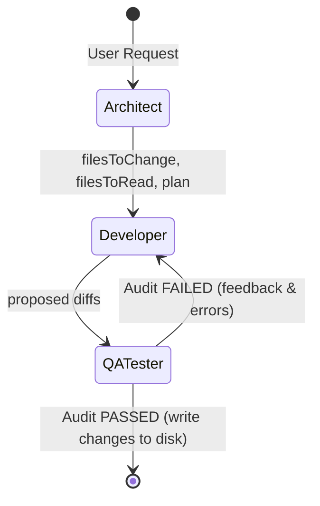

# 🤖 DevMesh Multi-Agent Engine Architecture

This document details the software engineering design, LangGraph mechanics, self-correction algorithms, and RAG search isolation patterns powering the DevMesh agent orchestration engine.

---

## 🛠️ The Orchestration Graph (LangGraph)

DevMesh models task execution as a **stateful, cyclic execution graph** built on the principles of LangGraph. Instead of a single, long prompt attempting to design, code, and debug, the task is divided among specialized agents with discrete inputs, tools, and outputs.



---

## 👥 Agent Responsibilities & Pipeline Nodes

The graph state contains the following structure throughout execution:
```json
{
  "taskId": "string",
  "workspaceId": "string",
  "requestText": "string",
  "codebasePath": "string",
  "plan": "string",
  "filesToChange": ["array"],
  "filesToRead": ["array"],
  "currentCode": {"filePath": "content"},
  "qaFeedback": "string",
  "passed": false,
  "retryCount": 0,
  "maxRetries": 3,
  "currentNode": "string"
}
```

### 1. The Architect Node (`architectAgent.js`)
* **Objective**: Define the technical blueprint and identify dependencies.
* **Process**:
  1. Computes the user prompt's embedding vector.
  2. Queries the vector store (scoped to `state.workspaceId`).
  3. Formulates a plan and outputs a strict JSON schema containing `"plan"`, `"filesToChange"`, and `"filesToRead"`.
* **Token Optimization**: Rather than asking the developer agent to read the entire workspace, the Architect acts as a filter, instructing the Developer to *only* load the files that require edits or reference context.

---

### 2. The Developer Node (`developerAgent.js`)
* **Objective**: Write production-ready code edits.
* **Process**:
  1. Resolves all paths in `filesToChange` and `filesToRead` to absolute disk paths.
  2. Reads only those specific file contents into memory, completely ignoring unrelated codebase files.
  3. Prepend task history (if it's an in-place follow-up command).
  4. Calls the LLM to output the file modifications in a strict JSON format.
  5. Computes a line-by-line single-pass diff comparing the new code with the original contents.

---

### 3. The QA Tester Node (`qaTesterAgent.js`)
* **Objective**: Audit and validate compilation, syntax, and logic.
* **Process**:
  1. Reviews the proposed changes and checks for basic syntax mistakes.
  2. Compiles or dry-runs scripts based on the extension type (C++, JS, Python, etc.).
  3. Analyzes test results. If compile errors or test failures are detected:
     * Sets `state.passed = false`.
     * Writes a detailed markdown audit report of the compiler warnings or syntax faults to `state.qaFeedback`.
     * Increments `state.retryCount`.
  4. If everything compiles and runs successfully, sets `state.passed = true` and writes the audit analysis details.

---

## 🔄 Self-Correction & Feedback Loop

If the QA Tester Node fails the audit, the Router directs execution **back to the Developer Node** instead of stopping:

1. The Developer Agent receives the previous code files, the previous plan, and the **new `state.qaFeedback` (the compiler's diagnostic output)**.
2. The Developer uses the compiler warnings (e.g. `undefined variable on line 12`) to self-correct the code.
3. The corrected changes are passed back to the QA Tester.
4. This loop continues until:
   * **Audit Passes**: The graph state moves to `end`, and the backend commits the files to disk.
   * **Max Retries Reached (3 attempts)**: The graph state moves to `failed` and terminates, saving the diagnostic logs.

---

## 💿 RAG Workspace Isolation & Indexing

To support search capabilities in small, isolated workspaces:

### 1. Local Parsing & Chunking
* Files are parsed using `fileParser.js`, resolving paths relative to the workspace uploads folder rather than the backend root folder.
* Code is chunked at logical boundaries (like functions and class definitions) using `chunker.js`.

### 2. Vector DB Storage & Metadata
* Fallback JSON databases (`.vector-store-fallback.json`) are used if a remote ChromaDB server is offline.
* Chunks are stored with the following metadata:
  ```json
  {
    "id": "relative/path/to/file_chunk_0",
    "filePath": "relative/path/to/file",
    "content": "code content...",
    "workspaceId": "6a7778c000...",
    "embedding": [ ... ]
  }
  ```

### 3. Workspace Query Filtering
Queries sent to the vector store are strictly filtered on `workspaceId`:
* For ChromaDB: `where: { workspaceId: workspaceId }`
* For Fallback JSON: `database.filter(c => c.workspaceId === workspaceId)`
This guarantees that an agent executing prompts in Workspace A will **never** retrieve code files or snippets from Workspace B, eliminating cross-project leakage.

---

## ⚙️ Reliability & Rate-Limit Guardrails

To prevent failures on Groq's high-speed completion APIs:

* **Exponential Backoff Retries**: All API connections are wrapped in `callWithRetry.js`. If a rate limit block (`429 Too Many Requests`) or a server dropout occurs, the call is re-attempted after a dynamic delay.
* **Request Throttling**: The orchestrator enforces minimum delays between agent node invocations to ensure rate limits are never exceeded.
* **JSON Syntax Validator**: Prompts contain strict JSON formatting rules. If a JSON parsing error occurs on Groq output, the wrapper cleans the markdown wrapping, sanitizes invalid quote-escapes (`\'`), and parses it successfully.
