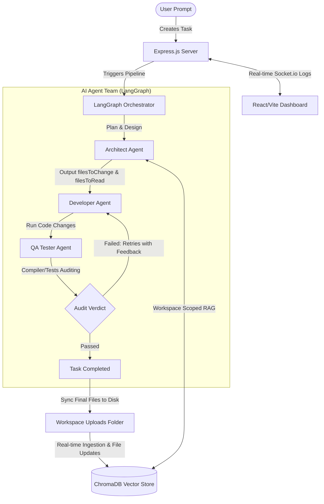

# 🚀 DevMesh: AI-Agentic Software Development Platform

DevMesh is a next-generation, multi-agent software engineering workspace. It leverages collaborative AI agents (Architect, Developer, and QA Tester) operating in a structured LangGraph workflow to ingest codebases, plan implementations, write optimal code, and perform automated compiler/lint validation audits.

---

## 🏗️ System Architecture

DevMesh is built as a highly optimized, high-performance monorepo:



---

## 📦 Monorepo Modules

This monorepo manages three core modules using `pnpm` workspaces:

* **[frontend](file:///f:/Final%20Year%20Project/DevMesh/frontend)**: A React SPA dashboard styled with vanilla CSS. Contains real-time agent flow visualizations, a line-by-line diff viewer, a full-featured Code Editor, and editable user profiles.
* **[backend](file:///f:/Final%20Year%20Project/DevMesh/backend)**: An Express.js REST API and WebSocket (Socket.io) server. Handles user authentication, workspace codebase storage, file writes, and background agent task dispatching.
* **[ai-agent](file:///f:/Final%20Year%20Project/DevMesh/ai-agent)**: The AI engine powered by Groq and LangGraph. Contains RAG vector store chunking/indexing, and code generation/auditing graphs.

---

## ✨ Core Features

* **Workspace-Scoped RAG Ingestion**: Automatically chunks and embeds uploaded workspace ZIP codebases into ChromaDB. Searches are strictly filtered by `workspaceId` to prevent cross-project file leakage.
* **In-Place Conversational Follow-up**: Submitting prompts inside an active task resets the agent pipeline in-place. The agent reads the conversation history and updates target files directly without creating redundant task records.
* **Pro Code Editor Tab**: A file explorer dropdown and editor panel allowing users to inspect, edit, and save any codebase file on disk at any time, instantly re-triggering RAG updates.
* **Automated QA Audit Reports**: Renders rich LLM-generated markdown diagnostic reports andGlowing tech-style badges instead of plain emoji stubs.
* **Render Keep-Alive Pinging**: The server automatically pings its own public URL every 10 minutes when hosted on Render to prevent cold shutdowns on free tiers.

---

## 🛠️ Quick Start

### Prerequisites
* **Node.js** (v18+)
* **PNPM** (v8+)
* **MongoDB** (Local or Atlas)
* **Groq API Key** (for agent completions)

### Setup & Run
1. Install all monorepo dependencies from the root:
   ```bash
   pnpm install
   ```

2. Configure environment files:
   * **Backend**: Create `backend/.env` (see `backend/.env.example`)
   * **Frontend**: Create `frontend/.env` (see `frontend/.env`)
   * **AI Agent**: Create `ai-agent/.env` (see `ai-agent/.env.example`)

3. Boot up the backend and frontend dev servers concurrently:
   ```bash
   pnpm dev
   ```
   * Frontend runs at `http://localhost:5173`
   * Backend runs at `http://localhost:5000`

---

## 📚 Detailed Documentation

For exhaustive developer guides and architectural deep-dives, refer to our core documentation resources:

* 🔌 **[API Reference Guide](API_DOCUMENTATION.md)**: Detailed JSON schemas, request/response models, and Socket.io event flows.
* 🤖 **[AI Agent Graph Specifications](AGENT_ARCHITECTURE.md)**: Details on LangGraph loops, self-correction feedback algorithms, and ChromaDB workspace RAG isolation.
* 🛠️ **[Troubleshooting & Setup Guide](TROUBLESHOOTING.md)**: Resolving MongoDB server timeouts, EADDRINUSE collisions, and Groq rate-limiting constraints.
* 🌐 **[Vercel & Render Deployment Walkthrough](DEPLOYMENT_GUIDE.md)**: Settings, env parameters, and monorepo workspace filters for public cloud hosting.
